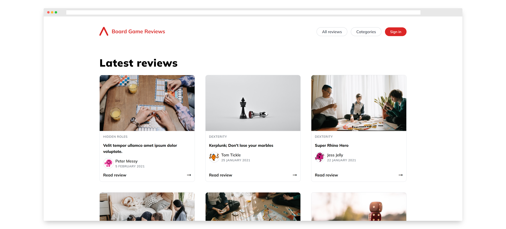

# NC Board Game Reviews

[Live version](https://nc-board-game-reviews.vercel.app/)

Please note the [API](https://github.com/amparoamparo/nc-board-game-reviews-api) is currently hosted on [render](https://render.com/)'s free tier, and it can take a few seconds to load for the first time.

## About the project

NC Board Game Reviews is a community-driven platform for board game lovers, where they come together to review board games and interact with each other.

I built this responsive website as part of an immersive full-stack coding bootcamp. I also built the API it uses from scratch, [check it out here](https://github.com/amparoamparo/nc-board-game-reviews-api).

*Note: there was no design provided, I loosely designed it on Figma myself before starting to style the website.*

Without signing in, users can:

- View latest reviews
- View all reviews
- Open a single review
- View how many votes and comments a review has
- Read comments on reviews
- View votes on comments
- Sign in

When signed in, users can also:

- Upvote a review
- Leave a comment
- Sign out

Features I'm currently working on:

- Post a review
- Show reviews by category
- Delete a comment
- Upvote a comment

### Built with

